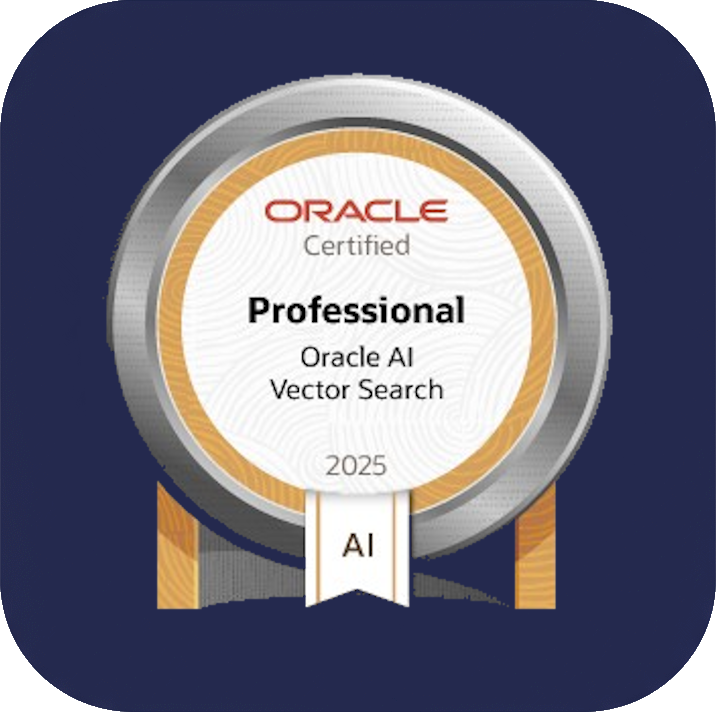
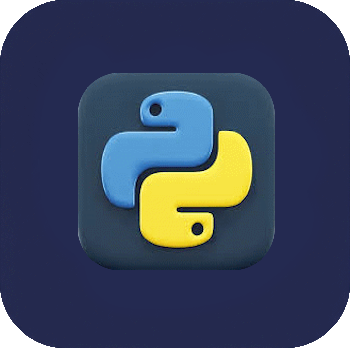
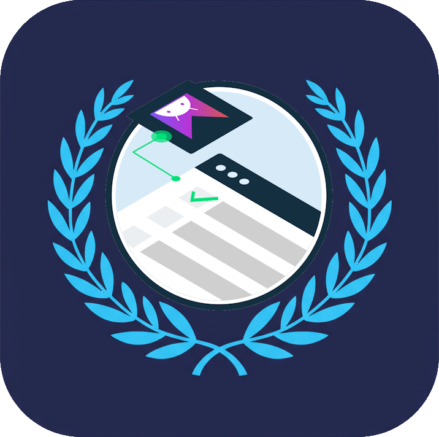
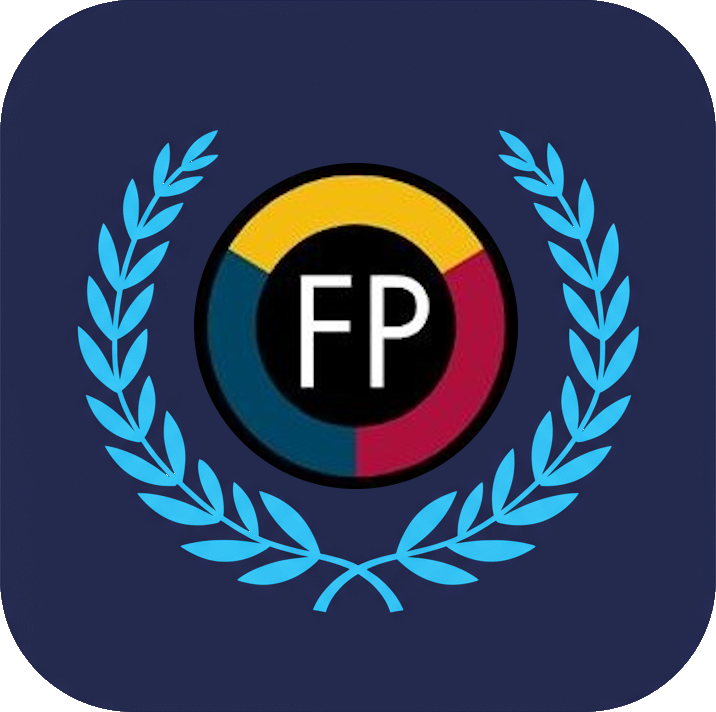

  
  <h1>👋 ¡Hola, soy Pedro Mencías!</h1>
  
Desarrollador apasionado con un enfoque en el aprendizaje continuo y la colaboración.

---

### 🚀 Sobre Mí

Soy un entusiasta de la programación siempre buscando nuevas formas de aprender y construir. Mi pasión radica en la resolución de problemas a través del código y en la constante exploración de nuevas tecnologías.

### 📚 Formación Continua

Saqué mi Titulación de Técnico Superior en Sistemas de Telecomunicaciones e Informática hace ya muchos años, pero nunca dejo de aprender cosas nuevas. No hay mejor aptitud que mantenerse actualizado... nuestro campo cambia constantemente. En la actualidad estoy aplicándome en las certificaciones de Oracle, y me alegra compartir que he logrado:

| | | |
|:---:|:---:|:---:|
|  |  |  |
| **OCI Foundations  AI** | **OCI Generative AI Professional** | **OCI AI Vector Search Professional** |
|  |  |  |
| **Python Avanzado** | **Introducción a Kotlin** | **Técnico Superior en Sistemas de** |
| **FreeCode Camp**| **Google Developers** | **Teleco+ e Informáticos** |

En cuanto a lenguajes de programación, estoy inmerso en el aprendizaje y la profundización de:

-   **Kotlin**: Explorando el desarrollo moderno de aplicaciones.
-   **React**: Construyendo interfaces de usuario dinámicas y reactivas.
-   **Python**: Utilizándolo para scripting, desarrollo backend y análisis de datos.

### 🌱 Mis Intereses

Me interesa todo lo relacionado con el desarrollo de software, desde la concepción de una idea hasta la implementación y optimización. Siempre estoy abierto a nuevos desafíos y a expandir mi conjunto de habilidades.

### ✨ Busco Colaborar

Me encantaría colaborar en proyectos que permitan **ayudar a otros** y en los que pueda aplicar mis conocimientos mientras sigo aprendiendo. Si tienes una idea o un proyecto en el que crees que puedo aportar, ¡no dudes en contactarme!

### 📬 ¿Cómo Contactarme?

La mejor forma de contactarme es a través de **email**. Puedes enviarme un correo electrónico y con gusto responderé.

[📧 Mi Correo](mailto:beyond.digital.web@gmail.com)

---

### ⚡ Dato Curioso

A pesar de mi experiencia, me considero un "newbie" eterno, siempre con ganas de aprender como si fuera el primer día. ¡Esa es la chispa que me mantiene motivado!

---

[📋 Visita mi Portafolio](https://pedromencias.netlify.app/)
[😏 Pásate por mi LinkedIn](https://www.linkedin.com/in/pedro-menc%C3%ADas-68223336b/)
[☕ Invitame aun Café](https://buymeacoffee.com/beyonddigiv)
[🐉 Blogs](https://androidalonia.wordpress.com/)
---
---

<h1>¡Gracias por visitar mi perfil! 😊</h1>

