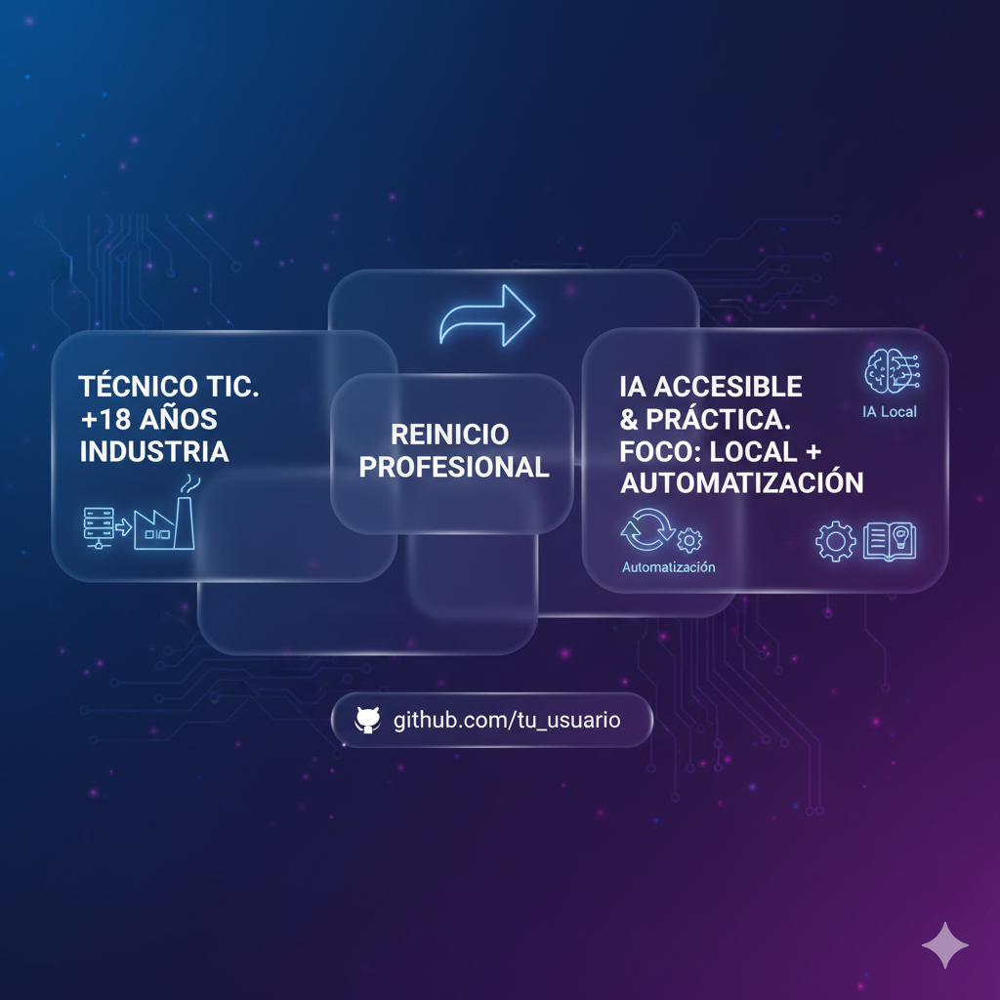

  
  <h1>👋 ¡Hola, soy Charran78!</h1>
  
Desarrollador apasionado con un enfoque en el aprendizaje continuo y la colaboración.

---

### 🚀 Sobre Mí

Soy **@Charran78**, un entusiasta de la programación siempre buscando nuevas formas de aprender y construir. Mi pasión radica en la resolución de problemas a través del código y en la constante exploración de nuevas tecnologías.

Actualmente estoy inmerso en el aprendizaje y la profundización de:

-   **Kotlin**: Explorando el desarrollo moderno de aplicaciones.
-   **React**: Construyendo interfaces de usuario dinámicas y reactivas.
-   **Python**: Utilizándolo para scripting, desarrollo backend y análisis de datos.

### 🌱 Mis Intereses

Me interesa todo lo relacionado con el desarrollo de software, desde la concepción de una idea hasta la implementación y optimización. Siempre estoy abierto a nuevos desafíos y a expandir mi conjunto de habilidades.

### ✨ Busco Colaborar

Me encantaría colaborar en proyectos que permitan **ayudar a otros** y en los que pueda aplicar mis conocimientos mientras sigo aprendiendo. Si tienes una idea o un proyecto en el que crees que puedo aportar, ¡no dudes en contactarme!

### 📬 ¿Cómo Contactarme?

La mejor forma de contactarme es a través de **email**. Puedes enviarme un correo electrónico y con gusto responderé.

### 📊 Mis Estadísticas en GitHub

Aquí puedes ver un resumen de mi actividad y contribuciones en GitHub (estas insignias se actualizan automáticamente):

  
  

---

### ⚡ Dato Curioso

A pesar de mi experiencia, me considero un "newbie" eterno, siempre con ganas de aprender como si fuera el primer día. ¡Esa es la chispa que me mantiene motivado!

---

  
¡Gracias por visitar mi perfil! 😊

